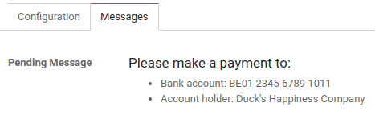

==============
Wire transfers
==============

The **Wire transfer** payment method allows you to provide payment instructions to your customers,
such as the bank details and the communication to be used. They are displayed:

- at the end of the checkout process, once the customer has selected **Wire transfer** as a payment
  method and clicked the :guilabel:`Pay now` button:

  .. image:: wire_transfer/payment_instructions_checkout.png
     :align: center
     :alt: Payment instructions at checkout

- on the customer portal:

  .. image:: wire_transfer/payment_instructions_portal.png
     :align: center
     :alt: Payment instructions on the customer portal

.. note::

   - While this method is very accessible and requires minimal setup, it is very inefficient
     process-wise. We recommend setting up a :doc:`payment acquirer <../payment_acquirers>` instead.
   - Online orders remain in the "Quotation sent" (i.e., unpaid order) stage until you receive
     the payment and :guilabel:`Confirm` the order.

.. tip::
   **Wire transfer** can be used as a template for other payment methods that are processed
   manually, such as checks. Just rename or duplicate it.

Configuration
=============

**Wire Transfer** is installed and enabled by default.

Select the :guilabel:`Communication` to be used in the :guilabel:`Configuration` tab:

- :guilabel:`Based on Document Reference`: sales order or invoice number
- :guilabel:`Based on Customer ID`: customer identifier

Define the payment instructions in the :guilabel:`Messages` tab:

